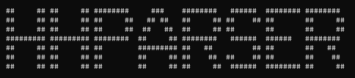

# hhparser

### Запуск скрипта

1. Открыть терминал в папке проекта
2. Установить зависимости, в терминал - `npm install`
3. Запустить парсер, в терминал - `node index.js`

### Этап разработки

На данном этапе скрипт способен:
1. Пробегать по первой странице career.habr.com
2. Забирать все вакансии
3. Переходить на каждую вакансию, забирать оттуда ссылку на сайт
4. Переходить на каждый сайт, забирать доступные почты, для дальнейшего использования

